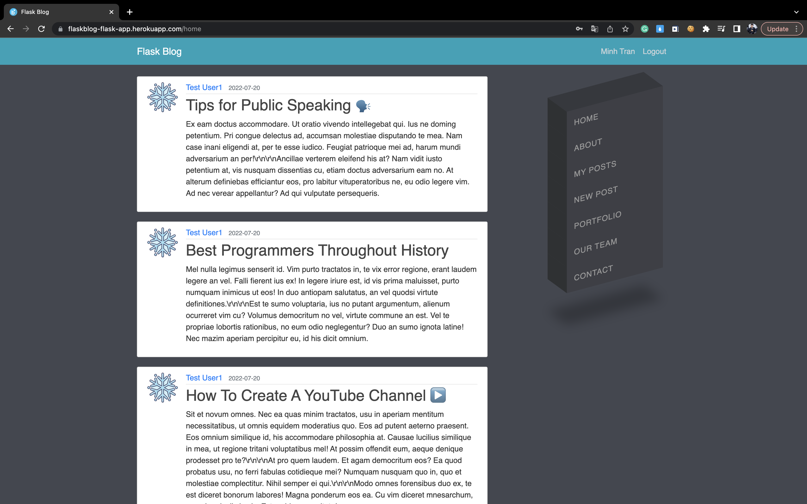

<h1> Flask Blog </h1>

### ✅ Flask Blog

### _Create an account and post anything you want 📣_

### Link :link: https://flaskblog-flask-app.herokuapp.com/

## Introduction

This is the Blog Engine built with Flask, Flask-SQLAlchemy, WTForms, Flask-WTF, Flask-Login, Flask-Mail

## Purpose

I create Flask Blog as my first Flask project. 
In the future, I want to learn more about Flask framework 

